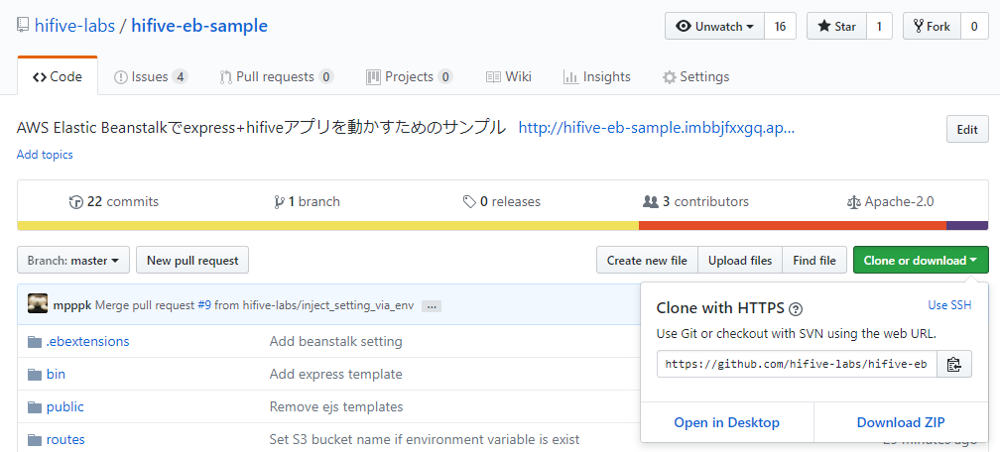
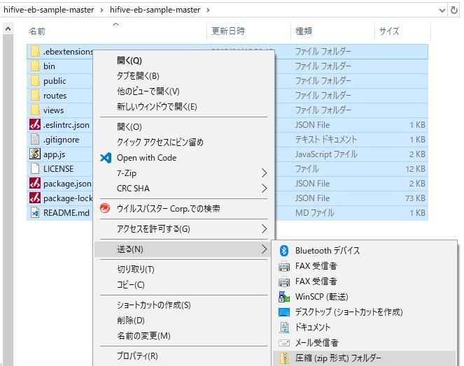
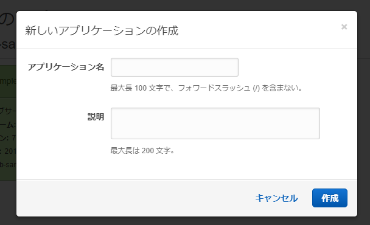
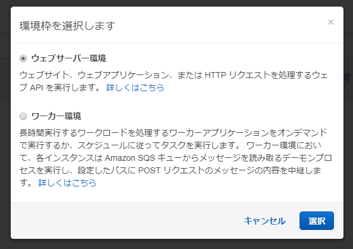
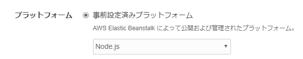
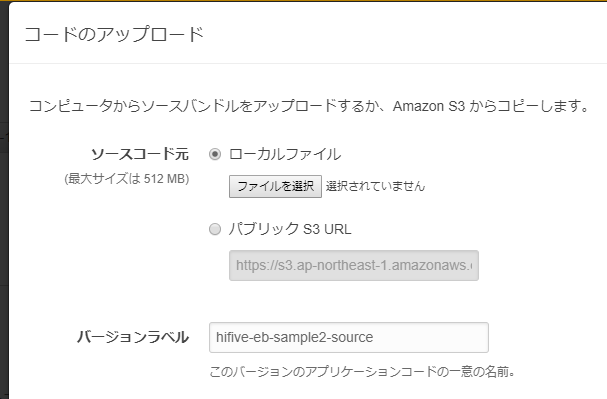

# hifive-aws-sample
hifiveを使ってAWSサービスを利用するサンプルアプリです。
Elasitc Beanstalkへデプロイするための設定や、S3経由でrekognitionに画像を投げるJSON APIの実装が含まれています。

## Usage
「画像認識をする」をクリックしてjpgかpngの画像をアップロードすると、その画像に含まれている要素がjsonで表示されます。

例) hifiveのロゴをアップロードした場合


結果:

```json
{
   "Labels":[
      {
         "Name":"Logo",
         "Confidence":98.00382232666016
      },
      {
         "Name":"Trademark",
         "Confidence":98.00382232666016
      },
      {
         "Name":"Text",
         "Confidence":54.29717254638672
      },
      {
         "Name":"Alphabet",
         "Confidence":52.34848403930664
      },
      {
         "Name":"Ampersand",
         "Confidence":52.34848403930664
      }
   ],
   "OrientationCorrection":"ROTATE_0"
}
```

## beanstalk上で動作させる手順(webコンソール経由)

1. GitHubからhifive-aws-sampleをzipでダウンロード
    
1. ダウンロードしたzipを一度解凍したら、中身のファイルを全部選択して右クリックし、「送る」→圧縮(zip形式)フォルダーで再度zipファイルを作成
    
1. [Elastic Beanstalkのコンソール](https://ap-northeast-1.console.aws.amazon.com/elasticbeanstalk/home?region=ap-northeast-1)へアクセス
1. 右上の「新しいアプリケーションの作成」をクリックし、名前と説明を適当に入れる
    * ここではhifive-aws-sampleとします
    
1. 「このアプリケーションの環境は現在存在しません。 今すぐ作成しましょう。」と表示されるので、「今すぐ作成しましょう。」をクリック
1. 表示されたダイアログで、ウェブサーバ環境を選んで「選択」をクリック
    
1. プラットフォームは事前設定済みプラットフォームからNode.jsを選択
    
1. アプリケーションコードでコードのアップロードを選択し、最初に作ったzipを選択
    
1. 環境の作成をクリック
1. 作成が終わったら、IAMからaws-elasticbeanstalk-ec2-roleにAmazonRekognitionFullAccessとAmazonS3FullAccessを追加
    * TODO: スクリーンショットを貼る
    * Elastic Beanstalkアプリのデフォルトroleを直接編集しているので、サンプルアプリのテストが終わったら削除してください
1. しばらく待つと右上にURLが出てくるのでクリック
    
1. 画面が表示されればOK

## beanstalk上で動作させる手順(CLI経由)
[こちら](https://docs.aws.amazon.com/ja_jp/elasticbeanstalk/latest/dg/eb-cli3.html)を参考に、ebコマンドをインストールしておく必要があります。

```sh
$ git clone https://github.com/hifive-labs/hifive-aws-sample
$ cd hifive-aws-sample
$ eb init --platform node.js --region ap-northeast-1
$ eb create test-env
$ eb deploy
```

## ローカルで動作させる手順
S3とRekognitionへのFullAccessが必要なので、あらかじめAWSのcredentialsの設定をしておいてください。

```
$ git clone https://github.com/hifive-labs/hifive-aws-sample
$ cd hifive-aws-sample
$ npm install
$ npm start
$ start http://localhost:3000
```

## クライアントのみローカルで動作させる手順

```
$ git clone https://github.com/hifive-labs/hifive-aws-sample
$ cd hifive-aws-sample
$ start public/javascripts/logics/RekognitionLogic.js
# apiHostの値を空文字列から'http://hifive-aws-sample.ap-northeast-1.elasticbeanstalk.com'に変更
$ start public/index.html # もしくはエクスプローラからpublic/index.htmlをダブルクリック
```

## 設定
サンプルアプリの設定は環境変数を介して変更できます。

環境変数 | 影響
------- | ------
HTTPS_PROXY | AWSへのリクエストする際のプロキシ。設定されていない場合はプロキシを利用しない。
HIFIVE_AWS_SAMPLE_S3_BUCKET | 画像をアップロードする先のS3 bucket名。デフォルトは'hifive-aws-sample'
